# Semaphore Optimization Report

Test Run: 20250428_142553

This report compares different combinations of PDF_PROCESSOR_SEMAPHORE and IMG_DESC_SEMAPHORE values to find the optimal configuration for throughput and stability.

All images can be found in the `images/` directory.

## Runtime Statistics

- Total test combinations: 125
- Total runtime: 17:26:37
- Average test runtime: 0:08:22
- Fastest test: 0:03:31
- Slowest test: 0:15:54

## Success Rate (%) - Concurrency: 8

|   pdf_sem |     8 |    12 |    17 |    21 |    34 |
|-----------|-------|-------|-------|-------|-------|
|         8 | 100.0 | 100.0 | 100.0 | 100.0 | 100.0 |
|        12 | 100.0 | 100.0 | 100.0 | 100.0 | 100.0 |
|        17 | 100.0 | 100.0 | 100.0 | 100.0 | 100.0 |
|        21 | 100.0 | 100.0 | 100.0 | 100.0 | 100.0 |
|        34 | 100.0 | 100.0 | 100.0 | 100.0 | 100.0 |

## Success Rate (%) - Concurrency: 12

|   pdf_sem |     8 |    12 |    17 |    21 |    34 |
|-----------|-------|-------|-------|-------|-------|
|         8 | 100.0 | 100.0 | 100.0 |  91.7 | 100.0 |
|        12 | 100.0 | 100.0 | 100.0 | 100.0 | 100.0 |
|        17 | 100.0 | 100.0 | 100.0 | 100.0 | 100.0 |
|        21 | 100.0 | 100.0 | 100.0 | 100.0 | 100.0 |
|        34 | 100.0 | 100.0 | 100.0 | 100.0 | 100.0 |

## Success Rate (%) - Concurrency: 17

|   pdf_sem |     8 |    12 |    17 |    21 |    34 |
|-----------|-------|-------|-------|-------|-------|
|         8 | 100.0 | 100.0 | 100.0 | 100.0 | 100.0 |
|        12 | 100.0 | 100.0 | 100.0 | 100.0 | 100.0 |
|        17 | 100.0 | 100.0 |   0.0 | 100.0 | 100.0 |
|        21 | 100.0 | 100.0 | 100.0 | 100.0 | 100.0 |
|        34 | 100.0 | 100.0 | 100.0 | 100.0 | 100.0 |

## Success Rate (%) - Concurrency: 21

|   pdf_sem |     8 |    12 |    17 |    21 |    34 |
|-----------|-------|-------|-------|-------|-------|
|         8 | 100.0 | 100.0 |   0.0 | 100.0 | 100.0 |
|        12 | 100.0 | 100.0 | 100.0 | 100.0 | 100.0 |
|        17 | 100.0 | 100.0 | 100.0 | 100.0 | 100.0 |
|        21 | 100.0 | 100.0 | 100.0 | 100.0 | 100.0 |
|        34 | 100.0 | 100.0 | 100.0 | 100.0 | 100.0 |

## Success Rate (%) - Concurrency: 34

|   pdf_sem |    8 |    12 |   17 |   21 |   34 |
|-----------|------|-------|------|------|------|
|         8 | 91.2 |  85.3 |  0.0 | 94.1 | 82.4 |
|        12 | 70.6 |  85.3 | 91.2 | 79.4 | 94.1 |
|        17 | 88.2 |  79.4 | 97.1 | 82.4 | 91.2 |
|        21 | 94.1 | 100.0 | 91.2 | 91.2 | 85.3 |
|        34 | 73.5 |  79.4 | 79.4 | 82.4 | 91.2 |

## Average Processing Time (s) - Concurrency: 8

|   pdf_sem |      8 |     12 |     17 |     21 |     34 |
|-----------|--------|--------|--------|--------|--------|
|         8 | 156.17 | 148.88 | 158.52 | 140.08 | 156.29 |
|        12 | 158.58 | 144.25 | 158.91 | 149.25 | 152.37 |
|        17 | 154.70 | 140.23 | 147.52 | 148.04 | 145.47 |
|        21 | 151.51 | 159.15 | 153.54 | 167.00 | 162.65 |
|        34 | 157.86 | 152.91 | 149.91 | 159.17 | 149.43 |

## Average Processing Time (s) - Concurrency: 12

|   pdf_sem |      8 |     12 |     17 |     21 |     34 |
|-----------|--------|--------|--------|--------|--------|
|         8 | 175.19 | 176.54 | 192.22 | 167.70 | 178.32 |
|        12 | 192.19 | 174.22 | 205.22 | 187.71 | 184.37 |
|        17 | 192.61 | 182.34 | 189.58 | 179.78 | 181.27 |
|        21 | 180.22 | 191.33 | 196.50 | 186.85 | 180.46 |
|        34 | 189.51 | 180.84 | 178.84 | 171.63 | 188.62 |

## Average Processing Time (s) - Concurrency: 17

|   pdf_sem |      8 |     12 |      17 |     21 |     34 |
|-----------|--------|--------|---------|--------|--------|
|         8 | 219.96 | 219.62 |  229.53 | 232.89 | 221.79 |
|        12 | 232.32 | 220.72 |  238.28 | 217.85 | 224.10 |
|        17 | 227.11 | 212.30 | 9999.00 | 240.87 | 229.58 |
|        21 | 250.67 | 226.73 |  211.57 | 228.73 | 231.61 |
|        34 | 209.62 | 223.25 |  235.05 | 240.46 | 219.18 |

## Average Processing Time (s) - Concurrency: 21

|   pdf_sem |      8 |     12 |      17 |     21 |     34 |
|-----------|--------|--------|---------|--------|--------|
|         8 | 270.52 | 270.53 | 9999.00 | 280.07 | 271.50 |
|        12 | 286.82 | 281.57 |  257.98 | 267.70 | 261.58 |
|        17 | 291.29 | 263.75 |  278.53 | 260.31 | 297.00 |
|        21 | 260.49 | 257.42 |  258.78 | 260.45 | 262.44 |
|        34 | 265.04 | 264.70 |  251.84 | 295.83 | 273.97 |

## Average Processing Time (s) - Concurrency: 34

|   pdf_sem |      8 |     12 |      17 |     21 |     34 |
|-----------|--------|--------|---------|--------|--------|
|         8 | 343.19 | 349.65 | 9999.00 | 358.55 | 336.84 |
|        12 | 328.82 | 335.67 |  352.83 | 328.16 | 350.68 |
|        17 | 353.18 | 330.79 |  348.07 | 347.10 | 344.20 |
|        21 | 351.86 | 316.37 |  342.40 | 354.18 | 345.98 |
|        34 | 318.23 | 341.29 |  332.58 | 352.38 | 358.61 |

## Max VRAM Usage (MiB) - Concurrency: 8

|   pdf_sem |    8 |   12 |   17 |   21 |   34 |
|-----------|------|------|------|------|------|
|         8 | 7754 | 6750 | 6810 | 6796 | 6968 |
|        12 | 6288 | 6858 | 6694 | 6682 | 6952 |
|        17 | 6726 | 7238 | 6804 | 6800 | 7290 |
|        21 | 6766 | 6568 | 7128 | 7096 | 6776 |
|        34 | 6770 | 7000 | 6572 | 6572 | 6794 |

## Max VRAM Usage (MiB) - Concurrency: 12

|   pdf_sem |    8 |   12 |   17 |   21 |   34 |
|-----------|------|------|------|------|------|
|         8 | 7284 | 7198 | 6566 | 6574 | 6930 |
|        12 | 6708 | 6810 | 6882 | 6974 | 6870 |
|        17 | 7152 | 7498 | 7050 | 6902 | 6998 |
|        21 | 6470 | 7018 | 6882 | 6876 | 6942 |
|        34 | 6490 | 7296 | 6804 | 6788 | 6868 |

## Max VRAM Usage (MiB) - Concurrency: 17

|   pdf_sem |    8 |   12 |   17 |   21 |   34 |
|-----------|------|------|------|------|------|
|         8 | 6860 | 6764 | 7144 | 7264 | 7168 |
|        12 | 6842 | 6892 | 6406 | 7118 | 6898 |
|        17 | 6762 | 6680 | 6790 | 7024 | 6660 |
|        21 | 6910 | 6882 | 6940 | 6884 | 6800 |
|        34 | 6950 | 7078 | 6842 | 7244 | 7136 |

## Max VRAM Usage (MiB) - Concurrency: 21

|   pdf_sem |    8 |   12 |   17 |   21 |   34 |
|-----------|------|------|------|------|------|
|         8 | 7098 | 6674 |    0 | 7004 | 6822 |
|        12 | 7254 | 7116 | 7674 | 6792 | 6728 |
|        17 | 7656 | 6908 | 7676 | 6454 | 7670 |
|        21 | 6980 | 6524 | 6686 | 7314 | 7772 |
|        34 | 7142 | 6750 | 6794 | 7078 | 6392 |

## Max VRAM Usage (MiB) - Concurrency: 34

|   pdf_sem |    8 |   12 |   17 |   21 |   34 |
|-----------|------|------|------|------|------|
|         8 | 7136 | 6928 |    0 | 6592 | 6760 |
|        12 | 6384 | 7118 | 7016 | 6916 | 6738 |
|        17 | 7216 | 6884 | 6628 | 6534 | 6786 |
|        21 | 7098 | 7070 | 6634 | 7398 | 7018 |
|        34 | 6764 | 7276 | 6778 | 6660 | 7392 |

## Test Runtime (s) - Concurrency: 8

|   pdf_sem |   8 |   12 |   17 |   21 |   34 |
|-----------|-----|------|------|------|------|
|         8 | 221 |  219 |  231 |  408 |  437 |
|        12 | 419 |  426 |  432 |  408 |  429 |
|        17 | 419 |  397 |  413 |  418 |  426 |
|        21 | 433 |  223 |  216 |  238 |  233 |
|        34 | 232 |  217 |  211 |  223 |  215 |

## Test Runtime (s) - Concurrency: 12

|   pdf_sem |   8 |   12 |   17 |   21 |   34 |
|-----------|-----|------|------|------|------|
|         8 | 278 |  276 |  290 |  823 |  469 |
|        12 | 498 |  472 |  523 |  480 |  483 |
|        17 | 502 |  503 |  497 |  467 |  493 |
|        21 | 494 |  295 |  302 |  291 |  279 |
|        34 | 294 |  280 |  280 |  268 |  287 |

## Test Runtime (s) - Concurrency: 17

|   pdf_sem |   8 |   12 |   17 |   21 |   34 |
|-----------|-----|------|------|------|------|
|         8 | 367 |  378 |  378 |  587 |  564 |
|        12 | 610 |  578 |  599 |  577 |  582 |
|        17 | 563 |  564 |  830 |  612 |  574 |
|        21 | 618 |  366 |  351 |  376 |  398 |
|        34 | 344 |  368 |  377 |  379 |  354 |

## Test Runtime (s) - Concurrency: 21

|   pdf_sem |   8 |   12 |   17 |   21 |   34 |
|-----------|-----|------|------|------|------|
|         8 | 456 |  449 |  447 |  666 |  651 |
|        12 | 696 |  685 |  629 |  654 |  646 |
|        17 | 702 |  634 |  674 |  650 |  711 |
|        21 | 442 |  435 |  443 |  432 |  438 |
|        34 | 445 |  442 |  429 |  480 |  454 |

## Test Runtime (s) - Concurrency: 34

|   pdf_sem |   8 |   12 |   17 |   21 |   34 |
|-----------|-----|------|------|------|------|
|         8 | 624 |  623 |  803 |  814 |  863 |
|        12 | 955 |  855 |  871 |  880 |  776 |
|        17 | 841 |  864 |  842 |  857 |  824 |
|        21 | 623 |  545 |  624 |  623 |  624 |
|        34 | 623 |  624 |  624 |  624 |  623 |

## Optimal Configurations (100% Success Rate)

Below are the configurations that achieved a 100% success rate during testing, showing the fastest option (lowest average processing time) for each concurrency level:

|   Concurrency |   PDF Semaphore |   IMG Semaphore |   Avg Time (s) |   Max VRAM (MiB) | Test Runtime (s) | Test Number |
|---------------|-----------------|-----------------|----------------|------------------|------------------|-------------|
|             8 |               8 |              21 |         140.08 |             6796 |           407.77 |          16 |
|            12 |              34 |              21 |         171.63 |             6788 |           268.17 |         117 |
|            17 |              34 |               8 |         209.62 |             6950 |           344.26 |         103 |
|            21 |              34 |              17 |         251.84 |             6794 |           428.83 |         114 |
|            34 |              21 |              12 |         316.37 |             7070 |           545.05 |          85 |

## Recommendation

Based on the test results, achieving a 100% success rate is possible across various concurrency levels.

**RECOMMENDED CONFIGURATION (Balanced):**

- **Concurrency=8, PDF_PROCESSOR_SEMAPHORE=8, IMG_DESC_SEMAPHORE=21**
- This configuration provides the fastest average processing time (140.08s) among all tested 100% successful runs.
- It offers excellent stability and predictable performance for lower concurrency scenarios.

**OPTIONS FOR HIGHER THROUGHPUT (with 100% Success Rate):**

If maximizing the number of processed items over time (throughput) is more critical than the lowest individual processing time, consider configurations at higher concurrency levels that maintained 100% success:

- **Concurrency=12:** PDF=34, IMG=21 (Avg Time: 171.63s)
- **Concurrency=17:** PDF=34, IMG=8 (Avg Time: 209.62s)
- **Concurrency=21:** PDF=34, IMG=17 (Avg Time: 251.84s)
- **Concurrency=34:** PDF=21, IMG=12 (Avg Time: 316.37s)

The optimal choice depends on the specific operational goals, balancing the need for request speed, overall throughput, and system stability.

## Visualizations

Click the links below to view the visualization images:
\n### Success Rate (Concurrency: 8)
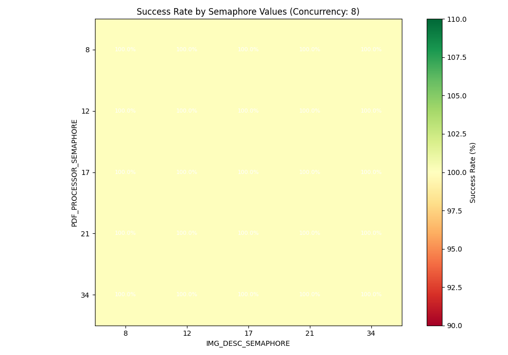
\n[View full size](images/success_rate_heatmap_conc8.png)\n
\n### Success Rate (Concurrency: 12)
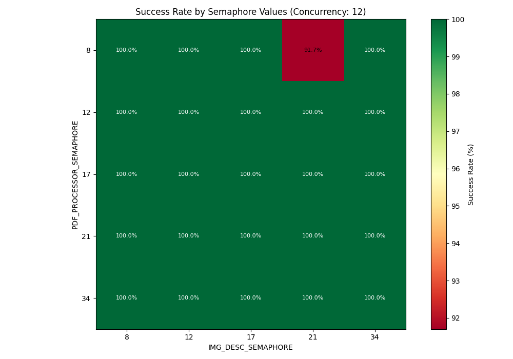
\n[View full size](images/success_rate_heatmap_conc12.png)\n
\n### Success Rate (Concurrency: 17)

\n[View full size](images/success_rate_heatmap_conc17.png)\n
\n### Success Rate (Concurrency: 21)

\n[View full size](images/success_rate_heatmap_conc21.png)\n
\n### Success Rate (Concurrency: 34)
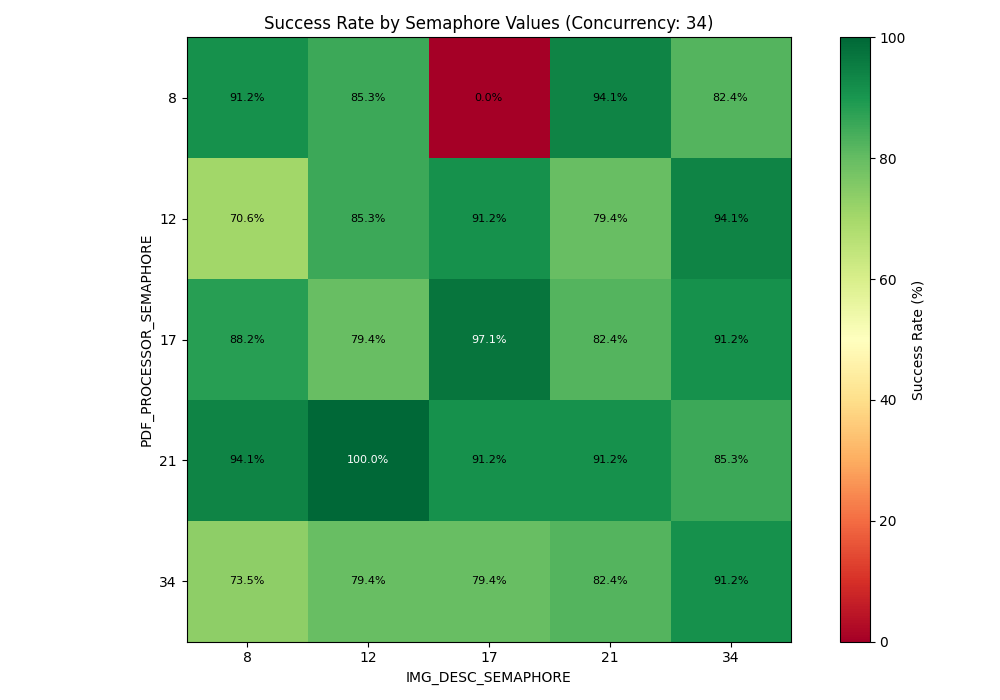
\n[View full size](images/success_rate_heatmap_conc34.png)\n
\n### Average Time (Concurrency: 8)

\n[View full size](images/avg_time_heatmap_conc8.png)\n
\n### Average Time (Concurrency: 12)

\n[View full size](images/avg_time_heatmap_conc12.png)\n
\n### Average Time (Concurrency: 17)

\n[View full size](images/avg_time_heatmap_conc17.png)\n
\n### Average Time (Concurrency: 21)

\n[View full size](images/avg_time_heatmap_conc21.png)\n
\n### Average Time (Concurrency: 34)
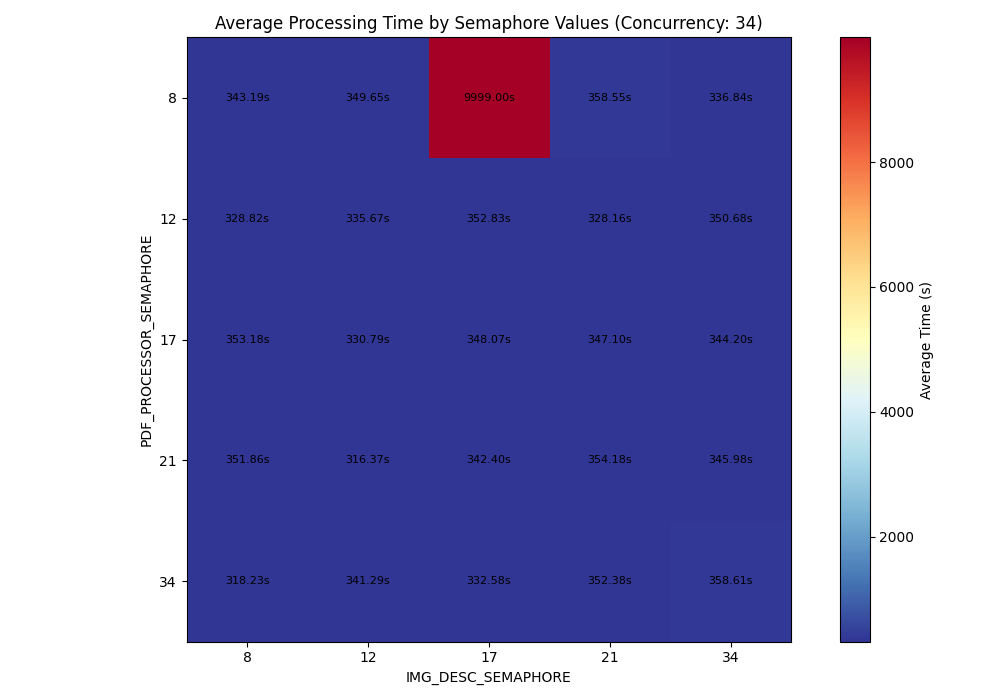
\n[View full size](images/avg_time_heatmap_conc34.png)\n
\n### VRAM Usage (Concurrency: 8)

\n[View full size](images/vram_usage_heatmap_conc8.png)\n
\n### VRAM Usage (Concurrency: 12)
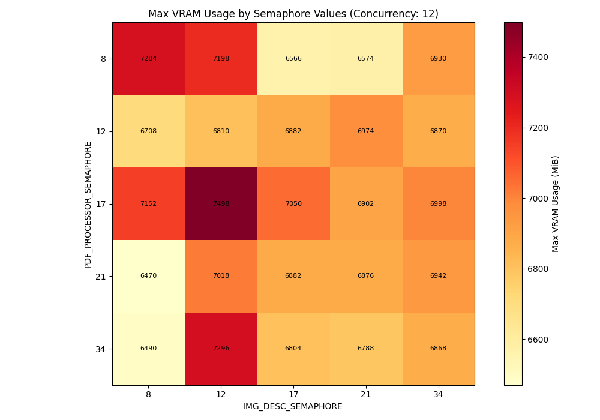
\n[View full size](images/vram_usage_heatmap_conc12.png)\n
\n### VRAM Usage (Concurrency: 17)
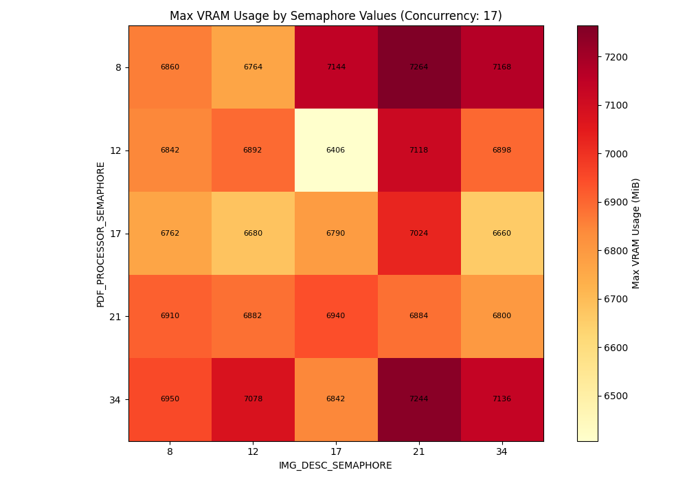
\n[View full size](images/vram_usage_heatmap_conc17.png)\n
\n### VRAM Usage (Concurrency: 21)
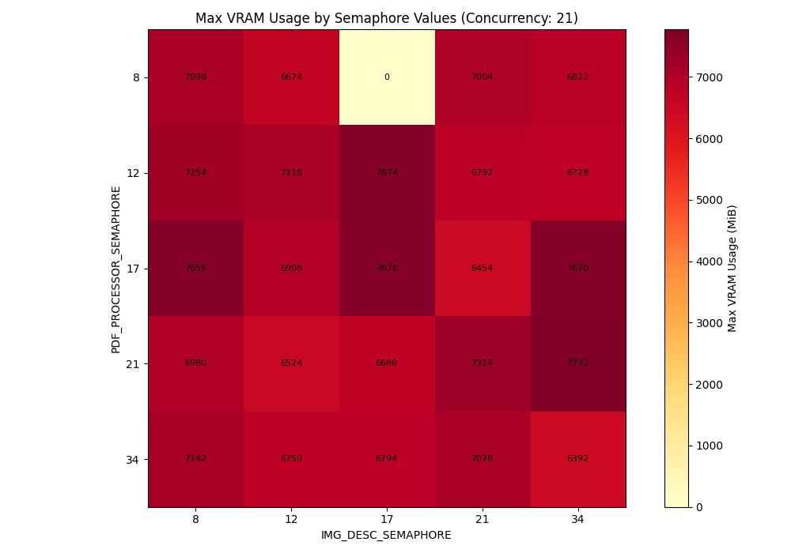
\n[View full size](images/vram_usage_heatmap_conc21.png)\n
\n### VRAM Usage (Concurrency: 34)
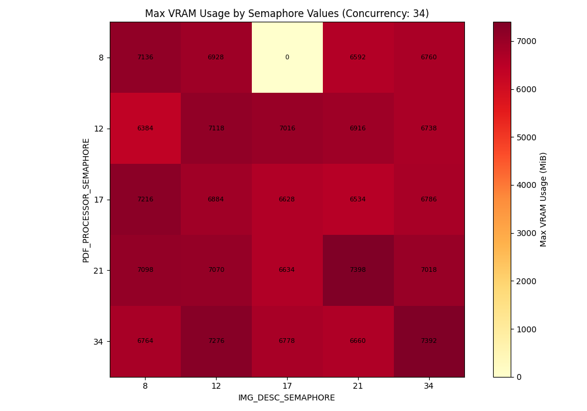
\n[View full size](images/vram_usage_heatmap_conc34.png)\n
\n### Test Runtime (Concurrency: 8)
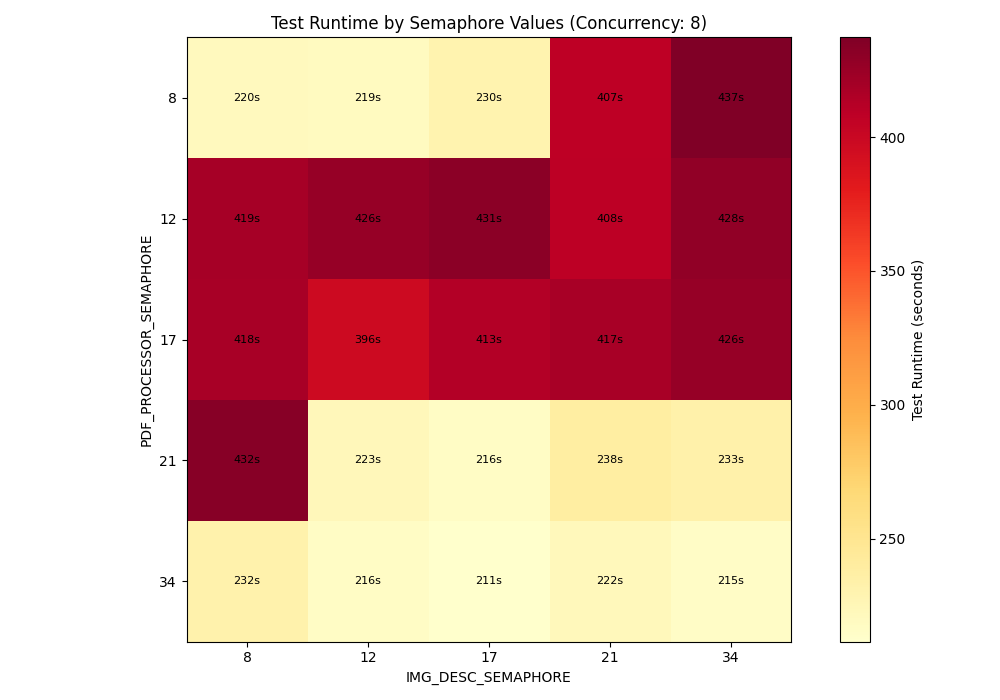
\n[View full size](images/test_runtime_heatmap_conc8.png)\n
\n### Test Runtime (Concurrency: 12)
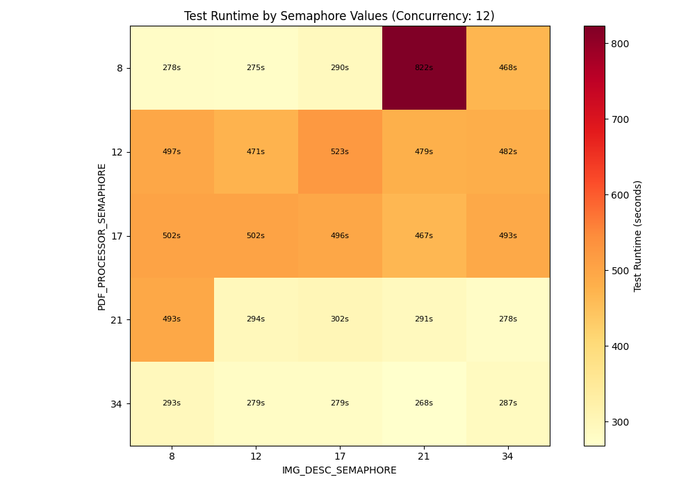
\n[View full size](images/test_runtime_heatmap_conc12.png)\n
\n### Test Runtime (Concurrency: 17)
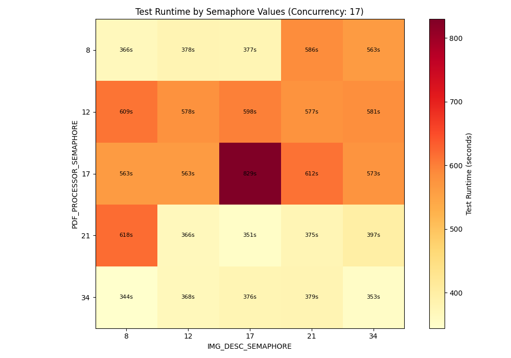
\n[View full size](images/test_runtime_heatmap_conc17.png)\n
\n### Test Runtime (Concurrency: 21)
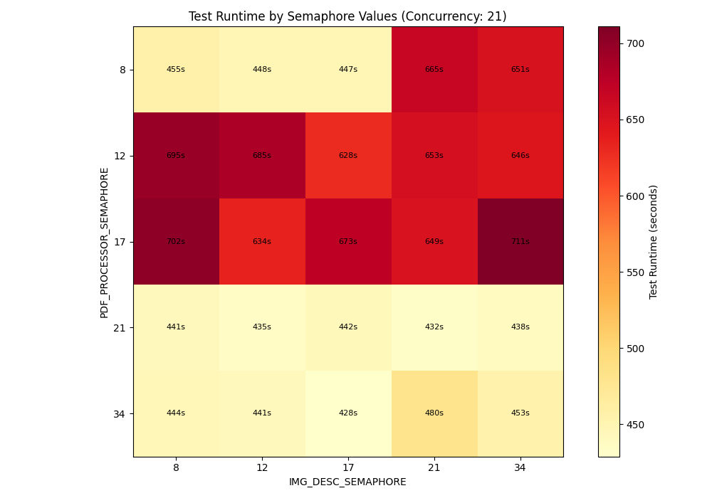
\n[View full size](images/test_runtime_heatmap_conc21.png)\n
\n### Test Runtime (Concurrency: 34)
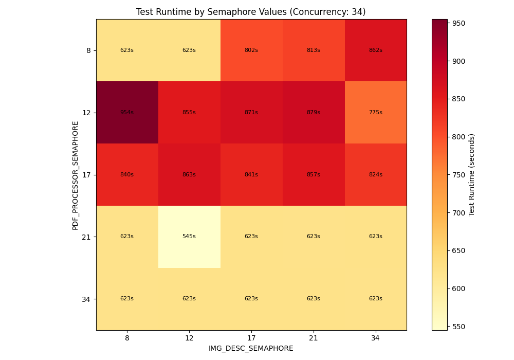
\n[View full size](images/test_runtime_heatmap_conc34.png)\n
